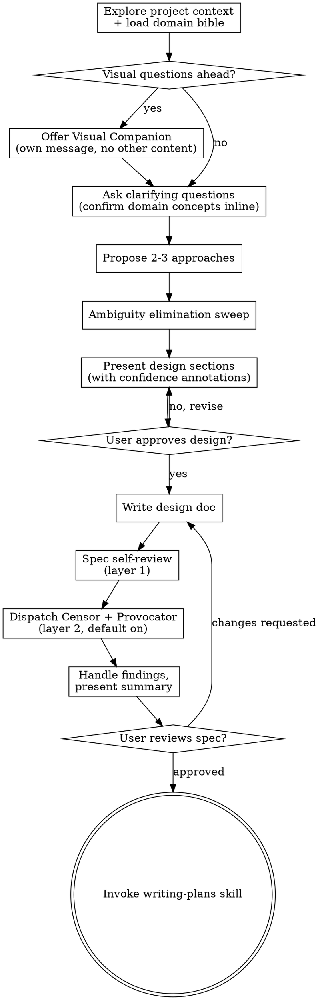

# Brainstorming + Writing-Plans Reshape Implementation Plan

> **For agentic workers:** REQUIRED SUB-SKILL: Use superpowers:subagent-driven-development (recommended) or superpowers:executing-plans to implement this plan task-by-task. Steps use checkbox (`- [ ]`) syntax for tracking.

**Goal:** Inject Consilium capabilities (persona, domain bible, ambiguity elimination, verification dispatch) into the existing brainstorming and writing-plans skills.

**Architecture:** Injection-point edits to two existing SKILL.md files. Existing content stays verbatim. New content is additive at specific locations. Old reviewer templates deleted after replacement.

**Tech Stack:** Markdown skill files. No code.

**Spec:** `docs/consilium/specs/2026-04-09-brainstorming-writing-plans-reshape-design.md`

---

## File Structure

| File | Change type |
|-|-|
| `skills/brainstorming/SKILL.md` | Modify — 6 injection points |
| `skills/writing-plans/SKILL.md` | Modify — 4 injection points |
| `skills/brainstorming/spec-document-reviewer-prompt.md` | Delete — replaced by verification engine |
| `skills/writing-plans/plan-document-reviewer-prompt.md` | Delete — replaced by verification engine |

---

### Task 1: Inject Consilium Identity into brainstorming SKILL.md

**Files:**
- Modify: `skills/brainstorming/SKILL.md`

- [ ] **Step 1: Add Consilium Identity section after frontmatter**

Insert immediately after the closing `---` of the frontmatter (after line 4), before the `# Brainstorming Ideas Into Designs` heading:

```markdown

## Consilium Identity

You are the Consul — Publius Auctor, presiding magistrate of the Consilium. Before proceeding, read your full identity and the shared law you operate under:

- **Your persona:** Read `skills/references/personas/consul.md` — this defines who you are, how you think, and how you serve the Imperator.
- **The Codex:** Read `skills/references/personas/consilium-codex.md` — this defines the law of the Consilium: finding categories, chain of evidence, auto-feed loop, independence rule.

You are in **brainstorming stance** — collaborative, exploratory. You ask questions, propose approaches, debate trade-offs, and draw out requirements the Imperator hasn't articulated. You push back when something doesn't add up. You load the domain bible and confirm domain understanding before proceeding.

```

- [ ] **Step 2: Commit**

```bash
git add skills/brainstorming/SKILL.md
git commit -m "feat(brainstorming): inject Consilium Identity — Consul persona activation"
```

---

### Task 2: Inject domain bible loading into brainstorming context exploration

**Files:**
- Modify: `skills/brainstorming/SKILL.md`

- [ ] **Step 1: Update checklist step 1**

Find the checklist item:
```
1. **Explore project context** — check files, docs, recent commits
```

Replace with:
```
1. **Explore project context** — check files, docs, recent commits. **Load domain bible:** read `skills/references/domain/MANIFEST.md` and select 1-3 domain files relevant to the topic.
```

- [ ] **Step 2: Add domain-aware probing to the "Understanding the idea" section**

Find the bullet point:
```
- Focus on understanding: purpose, constraints, success criteria
```

Add after it:
```
- **Domain awareness (Consul behavior):** When domain concepts appear in conversation, confirm your understanding against the loaded domain bible before proceeding. "I understand that a saved product is a customer-owned copy created through proofing — distinct from the catalog product. Is that correct?" This is not a formal phase — it's the Consul's natural behavior.
```

- [ ] **Step 3: Commit**

```bash
git add skills/brainstorming/SKILL.md
git commit -m "feat(brainstorming): inject domain bible loading and domain-aware probing"
```

---

### Task 3: Inject ambiguity elimination into brainstorming checklist and process

**Files:**
- Modify: `skills/brainstorming/SKILL.md`

- [ ] **Step 1: Add ambiguity elimination to the checklist**

Find the checklist items:
```
4. **Propose 2-3 approaches** — with trade-offs and your recommendation
5. **Present design** — in sections scaled to their complexity, get user approval after each section
```

Insert between them:
```
5. **Ambiguity elimination sweep** — after Imperator selects approach, before presenting design. List assumptions, resolve all ambiguity types.
```

And renumber subsequent items (5→6, 6→7, 7→8, 8→9, 9→10). Then insert two new items after the renumbered self-review:
```
9. **Dispatch verification** — Censor + Provocator via verification engine (default on, Imperator can skip)
10. **Handle findings** — per verification protocol, present summary with attribution to Imperator
```

Final renumbered items 11 and 12:
```
11. **User reviews written spec** — ask user to review the spec file before proceeding
12. **Transition to implementation** — invoke writing-plans skill to create implementation plan
```

The full updated checklist should read:

```
1. **Explore project context** — check files, docs, recent commits. **Load domain bible:** read `skills/references/domain/MANIFEST.md` and select 1-3 domain files relevant to the topic.
2. **Offer visual companion** (if topic will involve visual questions) — this is its own message, not combined with a clarifying question. See the Visual Companion section below.
3. **Ask clarifying questions** — one at a time, understand purpose/constraints/success criteria. Confirm domain concepts inline as they arise.
4. **Propose 2-3 approaches** — with trade-offs and your recommendation
5. **Ambiguity elimination sweep** — after Imperator selects approach, before presenting design. List assumptions, resolve all ambiguity types.
6. **Present design** — in sections scaled to their complexity, with inline confidence annotations, get user approval after each section
7. **Write design doc** — save to `docs/consilium/specs/YYYY-MM-DD-<topic>-design.md` and commit (user preferences for spec location override this default)
8. **Spec self-review** — quick inline check for placeholders, contradictions, ambiguity, scope (see below)
9. **Dispatch verification** — Censor + Provocator via verification engine (default on, Imperator can skip)
10. **Handle findings** — per verification protocol, present summary with attribution to Imperator
11. **User reviews written spec** — ask user to review the spec file before proceeding
12. **Transition to implementation** — invoke writing-plans skill to create implementation plan
```

- [ ] **Step 2: Add Ambiguity Elimination section**

Insert as a new section after the "Exploring approaches" section and before "Presenting the design" section:

```markdown
**Ambiguity elimination:**

After the Imperator selects an approach, before presenting the design:

1. List every assumption you're about to bake into the spec.
2. Classify each:
   - **Idea ambiguity** — only the Imperator can resolve. Ask directly, one at a time.
   - **Codebase ambiguity** — answerable by reading code. Dispatch exploration agent(s) to verify.
   - **Domain ambiguity** — answerable from the domain bible. Check the loaded files.
3. Resolve all three types before proceeding.
4. Any assumption that cannot be resolved gets marked Low confidence in the spec with an explicit note about what remains uncertain and why.

The goal: by the time you write the spec, almost everything is High confidence because ambiguity was eliminated, not annotated.
```

- [ ] **Step 3: Add inline confidence annotations to the "Presenting the design" section**

Find the bullet:
```
- Cover: architecture, components, data flow, error handling, testing
```

Add after it:
```
- **Inline confidence annotations:** Each section of the design carries a confidence annotation: `> **Confidence: High/Medium/Low** — [evidence]`. Write these as you present each section. They become part of the written spec and direct verification agents' scrutiny. High = Imperator was explicit or domain bible confirmed. Medium = your synthesis, not directly stated. Low = best guess (should be rare after ambiguity elimination).
```

- [ ] **Step 4: Commit**

```bash
git add skills/brainstorming/SKILL.md
git commit -m "feat(brainstorming): inject ambiguity elimination phase and confidence annotations"
```

---

### Task 4: Inject verification dispatch and update paths in brainstorming

**Files:**
- Modify: `skills/brainstorming/SKILL.md`

- [ ] **Step 1: Add verification dispatch section**

Find the "Spec Self-Review" section. After it ends (after "Fix any issues inline. No need to re-review — just fix and move on."), insert:

```markdown
**Verification Dispatch (Layer 2):**

After self-review passes, dispatch independent verification. This is the default — announce "Dispatching Censor and Provocator for verification." The Imperator can say "skip."

Read the verification protocol and spec verification template:
- `skills/references/verification/protocol.md`
- `skills/references/verification/templates/spec-verification.md`

Follow the template exactly: dispatch Censor + Provocator in parallel, handle findings per the protocol, present summary with finding attribution to the Imperator. Then proceed to the user review gate.
```

- [ ] **Step 2: Update spec path**

Find:
```
- Write the validated design (spec) to `docs/superpowers/specs/YYYY-MM-DD-<topic>-design.md`
```

Replace with:
```
- Write the validated design (spec) to `docs/consilium/specs/YYYY-MM-DD-<topic>-design.md`
```

- [ ] **Step 3: Update process flow diagram**

Find the dot graph `digraph brainstorming`. Replace the entire graph with:



- [ ] **Step 4: Commit**

```bash
git add skills/brainstorming/SKILL.md
git commit -m "feat(brainstorming): inject verification dispatch, update paths and flow diagram"
```

---

### Task 5: Reshape writing-plans SKILL.md

**Files:**
- Modify: `skills/writing-plans/SKILL.md`

- [ ] **Step 1: Add Consilium Identity section after frontmatter**

Insert immediately after the closing `---` of the frontmatter (after line 4), before the `# Writing Plans` heading:

```markdown

## Consilium Identity

You are the Consul — Publius Auctor, presiding magistrate of the Consilium. Before proceeding, read your full identity and the shared law you operate under:

- **Your persona:** Read `skills/references/personas/consul.md` — this defines who you are, how you think, and how you serve the Imperator.
- **The Codex:** Read `skills/references/personas/consilium-codex.md` — this defines the law of the Consilium: finding categories, chain of evidence, auto-feed loop, independence rule.

You are in **planning stance** — directive, precise. The spec is approved. The debate is over. You translate the spec into exact tasks with file paths, code, and execution order. No ambiguity, no placeholders. Every task is a clear order a Legatus can hand to a soldier.

```

- [ ] **Step 2: Add domain-informed exploration to File Structure section**

Find the "File Structure" section. After the last bullet point ("This structure informs the task decomposition..."), add:

```markdown

**Domain-informed exploration:** Before writing tasks, load domain knowledge via `skills/references/domain/MANIFEST.md`. Select 1-3 domain files relevant to the spec's entities and flows. Use the domain bible to:
- Verify file paths before referencing them in tasks
- Confirm hook return types, component props, API shapes
- Identify the right models/services to target (don't confuse catalog products with saved products — check the bible)

This is due diligence, not a formal sweep. The Praetor will catch what you miss.
```

- [ ] **Step 3: Add inline confidence annotations to Task Structure section**

Find the Task Structure section. After the task template code block, add:

```markdown

**Inline confidence annotations:** Each task carries a confidence annotation after the heading:

```markdown
### Task 3: Add display name hook
> **Confidence: High** — verified `useProduct` exists at `src/app/_hooks/useProduct.ts`, returns `product` with `metadata` field.
```

Levels: High (verified in codebase or domain bible), Medium (inferred, not confirmed), Low (best guess — flag what's uncertain). These direct the Praetor and Provocator during verification.
```

- [ ] **Step 4: Update default plan path**

Find:
```
**Save plans to:** `docs/superpowers/plans/YYYY-MM-DD-<feature-name>.md`
```

Replace with:
```
**Save plans to:** `docs/consilium/plans/YYYY-MM-DD-<feature-name>.md`
```

- [ ] **Step 5: Add verification dispatch after Self-Review section**

Find the "Self-Review" section. After it ends (after "If you find a spec requirement with no task, add the task."), insert:

```markdown

## Verification Dispatch (Layer 2)

After self-review passes, dispatch independent verification. This is the default — announce "Dispatching Praetor and Provocator for verification." The Imperator can say "skip."

Read the verification protocol and plan verification template:
- `skills/references/verification/protocol.md`
- `skills/references/verification/templates/plan-verification.md`

Follow the template exactly: dispatch Praetor + Provocator in parallel, handle findings per the protocol, present summary with finding attribution to the Imperator. Then proceed to the execution handoff.
```

- [ ] **Step 6: Commit**

```bash
git add skills/writing-plans/SKILL.md
git commit -m "feat(writing-plans): inject Consilium persona, domain bible, confidence annotations, verification dispatch"
```

---

### Task 6: Delete old reviewer templates

**Files:**
- Delete: `skills/brainstorming/spec-document-reviewer-prompt.md`
- Delete: `skills/writing-plans/plan-document-reviewer-prompt.md`

- [ ] **Step 1: Delete old brainstorming reviewer**

```bash
rm skills/brainstorming/spec-document-reviewer-prompt.md
```

- [ ] **Step 2: Delete old writing-plans reviewer**

```bash
rm skills/writing-plans/plan-document-reviewer-prompt.md
```

- [ ] **Step 3: Commit**

```bash
git add -u skills/brainstorming/spec-document-reviewer-prompt.md skills/writing-plans/plan-document-reviewer-prompt.md
git commit -m "chore: remove old reviewer templates — replaced by verification engine"
```

---

### Task 7: Final verification

- [ ] **Step 1: Verify brainstorming SKILL.md has all injection points**

Read `skills/brainstorming/SKILL.md` and verify:
- Consilium Identity section present after frontmatter
- Domain bible loading in checklist step 1
- Domain-aware probing in "Understanding the idea" section
- Ambiguity elimination in checklist (step 5) and as a process section
- Inline confidence annotations in "Presenting the design" section
- Updated checklist (12 steps)
- Updated process flow diagram (includes ambiguity elimination + verification)
- Verification dispatch section after self-review
- Spec path: `docs/consilium/specs/`

- [ ] **Step 2: Verify writing-plans SKILL.md has all injection points**

Read `skills/writing-plans/SKILL.md` and verify:
- Consilium Identity section present after frontmatter
- Domain-informed exploration in File Structure section
- Inline confidence annotations in Task Structure section
- Verification dispatch section after self-review
- Plan path: `docs/consilium/plans/`

- [ ] **Step 3: Verify old reviewer templates are deleted**

```bash
ls skills/brainstorming/spec-document-reviewer-prompt.md 2>&1
ls skills/writing-plans/plan-document-reviewer-prompt.md 2>&1
```

Both should return "No such file or directory."

- [ ] **Step 4: Verify cross-references**

Confirm all verification engine references point to correct files:
- `skills/references/verification/protocol.md` — exists
- `skills/references/verification/templates/spec-verification.md` — exists
- `skills/references/verification/templates/plan-verification.md` — exists
- `skills/references/personas/consul.md` — exists
- `skills/references/personas/consilium-codex.md` — exists
- `skills/references/domain/MANIFEST.md` — exists
