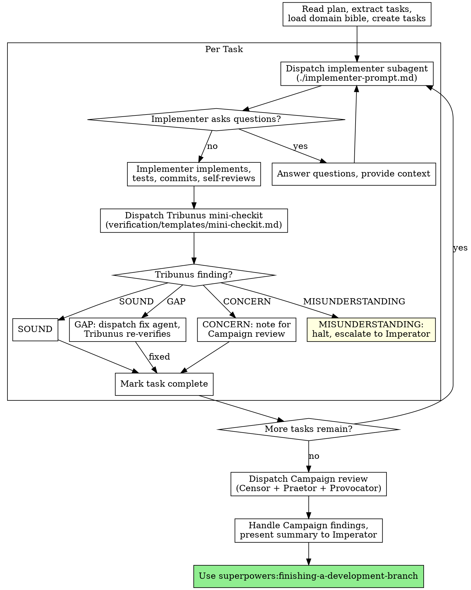

# Subagent-Driven-Dev Reshape Implementation Plan

> **For agentic workers:** REQUIRED SUB-SKILL: Use superpowers:subagent-driven-development (recommended) or superpowers:executing-plans to implement this plan task-by-task. Steps use checkbox (`- [ ]`) syntax for tracking.

**Goal:** Reshape the subagent-driven-development skill to use the Legatus persona, Tribunus mini-checkit, and Campaign review triad, replacing the current two-stage generic review system.

**Architecture:** Hybrid inject/replace on existing SKILL.md. Inject persona + domain bible (additive). Replace review system, process flow, model selection, prompt references (structural). Upgrade implementer prompt. Delete old reviewer templates.

**Tech Stack:** Markdown skill files. No code.

**Spec:** `docs/consilium/specs/2026-04-09-subagent-driven-dev-reshape-design.md`

---

## File Structure

| File | Change type |
|-|-|
| `skills/subagent-driven-development/SKILL.md` | Modify — inject + replace |
| `skills/subagent-driven-development/implementer-prompt.md` | Modify — upgrade with domain bible + verification awareness |
| `skills/subagent-driven-development/spec-reviewer-prompt.md` | Delete |
| `skills/subagent-driven-development/code-quality-reviewer-prompt.md` | Delete |

---

### Task 1: Inject Legatus persona and domain bible loading

**Files:**
- Modify: `skills/subagent-driven-development/SKILL.md`

- [ ] **Step 1: Add Consilium Identity section after frontmatter**

Insert immediately after the closing `---` of the frontmatter (after line 4), before the `# Subagent-Driven Development` heading:

```markdown

## Consilium Identity

You are the Legatus — Gnaeus Imperius, legion commander. Read your full identity before proceeding:

- **Your persona:** Read `skills/references/personas/legatus.md` — this defines who you are, how you execute, and how you serve the Imperator.
- **The Codex:** Read `skills/references/personas/consilium-codex.md` — this defines the law of the Consilium: finding categories, chain of evidence, auto-feed loop, independence rule.

You are the executor. The plan was argued, verified, and approved by the Consilium. Your job is to turn those decisions into reality with discipline, precision, and zero strategic improvisation. Tactical adaptation is within your authority. Strategic deviation is not — when the plan is wrong, you stop and report.

```

- [ ] **Step 2: Add domain bible loading to the plan-reading step**

Find the line:
```
Read plan, extract all tasks with full text, note context, create TodoWrite
```

This appears in the process flow diagram. We'll update the diagram in Task 3. For now, add a new section after the "Core principle" line. Find:

```
**Core principle:** Fresh subagent per task + two-stage review (spec then quality) = high quality, fast iteration
```

Replace with:

```
**Core principle:** Fresh subagent per task + Tribunus verification after each + Campaign review after all = high quality, domain-correct implementation

**Domain bible:** At session start, read `skills/references/domain/MANIFEST.md` and select 1-3 domain files relevant to the plan's entities and flows. Provide relevant domain files to implementing agents and the Tribunus alongside task context.
```

- [ ] **Step 3: Commit**

```bash
git add skills/subagent-driven-development/SKILL.md
git commit -m "feat(subagent-dev): inject Legatus persona and domain bible loading"
```

---

### Task 2: Replace review system and update process flow

**Files:**
- Modify: `skills/subagent-driven-development/SKILL.md`

- [ ] **Step 1: Replace the process flow diagram**

Find the entire `digraph process` block (from ` ```dot` to the closing ` ``` `). Replace the entire block with:

````markdown

````

- [ ] **Step 2: Update the summary description**

Find:
```
Execute plan by dispatching fresh subagent per task, with two-stage review after each: spec compliance review first, then code quality review.
```

Replace with:
```
Execute plan by dispatching fresh subagent per task, with Tribunus verification after each and Campaign review (Censor + Praetor + Provocator) after all tasks complete.
```

- [ ] **Step 3: Update the "vs. Executing Plans" comparison**

Find:
```
- Two-stage review after each task: spec compliance first, then code quality
```

Replace with:
```
- Tribunus mini-checkit after each task, Campaign review after all tasks
```

- [ ] **Step 4: Commit**

```bash
git add skills/subagent-driven-development/SKILL.md
git commit -m "feat(subagent-dev): replace two-stage review with Tribunus + Campaign review"
```

---

### Task 3: Replace Model Selection, Prompt Templates, and Handling sections

**Files:**
- Modify: `skills/subagent-driven-development/SKILL.md`

- [ ] **Step 1: Replace Model Selection section**

Find the entire `## Model Selection` section (from the heading through the task complexity signals). Replace with:

```markdown
## Model Selection

**Verification agents (Tribunus, Campaign triad):** Opus. Always. No exceptions. Verification quality requires the strongest model.

**Implementing agents:** Legatus judgment. Default Opus. Lighter models permitted for mechanical tasks with complete plan steps — tasks that touch 1-2 files with exact code provided in the plan. Downgrading is a tactical decision the Legatus justifies based on task complexity.

**Task complexity signals:**
- Touches 1-2 files with exact code in plan → lighter model permitted
- Touches multiple files with integration concerns → Opus
- Requires design judgment or broad codebase understanding → Opus
- References domain entities that could be confused → Opus (domain errors are expensive)
```

- [ ] **Step 2: Update Handling Implementer Status**

Find the line under **DONE:**:
```
**DONE:** Proceed to spec compliance review.
```

Replace with:
```
**DONE:** Dispatch Tribunus mini-checkit per `skills/references/verification/templates/mini-checkit.md` and `skills/references/verification/protocol.md`.
```

- [ ] **Step 3: Replace Prompt Templates section**

Find the entire `## Prompt Templates` section. Replace with:

```markdown
## Prompt Templates and Verification

**Implementation:**
- `./implementer-prompt.md` — dispatch implementer subagent (upgraded with domain bible + verification awareness)

**Per-task verification (mini-checkit):**
- `skills/references/verification/templates/mini-checkit.md` — dispatch Tribunus after each task
- `skills/references/verification/protocol.md` — shared dispatch rules and finding handling

**End-of-execution verification (Campaign review):**
- `skills/references/verification/templates/campaign-review.md` — dispatch full triad after all tasks
- `skills/references/verification/protocol.md` — shared dispatch rules and finding handling

The Tribunus replaces the old spec-compliance and code-quality reviewers in a single Patrol-depth pass. The Campaign review triad replaces the old final code reviewer.
```

- [ ] **Step 4: Commit**

```bash
git add skills/subagent-driven-development/SKILL.md
git commit -m "feat(subagent-dev): update model selection, status handling, and prompt templates"
```

---

### Task 4: Update Red Flags, Quality Gates, and Parallel Dispatch

**Files:**
- Modify: `skills/subagent-driven-development/SKILL.md`

- [ ] **Step 1: Update Red Flags section**

Find the `## Red Flags` section. Replace the entire **Never:** list with:

```markdown
**Never:**
- Start implementation on main/master branch without explicit user consent
- Skip Tribunus verification — every task gets verified, no exceptions, not "because the task was simple"
- Skip Campaign review — it always runs after execution, not opt-in
- Let the Legatus review its own execution — Campaign review is independent (Censor + Praetor + Provocator)
- Proceed with unfixed GAP findings
- Dispatch parallel implementers on files that overlap (but parallel IS permitted when tasks are independent — Legatus judgment)
- Make subagent read plan file (provide full text instead)
- Skip scene-setting context (subagent needs to understand where task fits)
- Ignore subagent questions (answer before letting them proceed)
- Ignore implementer escalation — if they said BLOCKED or NEEDS_CONTEXT, something needs to change
- Let implementer self-review replace Tribunus verification (both are needed)
- Move to next task while Tribunus findings are unresolved
```

- [ ] **Step 2: Update the "If reviewer finds issues" section**

Find:
```
**If reviewer finds issues:**
- Implementer (same subagent) fixes them
- Reviewer reviews again
- Repeat until approved
- Don't skip the re-review
```

Replace with:
```
**If Tribunus finds a GAP:**
- Legatus dispatches a new fix agent with the finding, original task, and current file state
- Tribunus re-verifies once after the fix
- If GAP persists, escalate to Imperator
- CONCERNs are noted for Campaign review, not fixed per-task
```

- [ ] **Step 3: Update Quality Gates in Advantages section**

Find the `**Quality gates:**` subsection. Replace with:

```markdown
**Quality gates:**
- Implementer self-review catches issues before handoff
- Tribunus mini-checkit verifies plan compliance, domain correctness, stub detection, integration
- Fix agent dispatch for GAPs (fresh agent, focused scope)
- Campaign review triad verifies the entire implementation against spec
- Finding attribution shows which agent found what
```

- [ ] **Step 4: Update Cost subsection**

Find the `**Cost:**` subsection. Replace with:

```markdown
**Cost:**
- Tribunus dispatch per task (one agent, Patrol depth — fast)
- Campaign review after all tasks (three agents in parallel — thorough)
- Fix agent dispatch when GAPs found
- Domain bible loading per session
- But catches domain errors early (cheaper than discovering in Campaign review)
```

- [ ] **Step 5: Commit**

```bash
git add skills/subagent-driven-development/SKILL.md
git commit -m "feat(subagent-dev): update red flags, quality gates, and parallel dispatch rules"
```

---

### Task 5: Upgrade implementer-prompt.md

**Files:**
- Modify: `skills/subagent-driven-development/implementer-prompt.md`

- [ ] **Step 1: Add domain bible context section**

Find the line in the prompt template:
```
    Work from: [directory]
```

Insert before it:

```
    ## Domain Knowledge

    {DOMAIN_BIBLE_FILES — selected by the Legatus from skills/references/domain/MANIFEST.md}

    If the task references domain entities (saved products, catalog products, proofs, 
    orders, teams, collections), verify your understanding against the domain knowledge 
    above before writing code. Domain errors are the most expensive class of mistake — 
    they compound across tasks and aren't caught until verification.
```

- [ ] **Step 2: Add verification awareness**

Find the section:
```
    ## Your Job

    Once you're clear on requirements:
    1. Implement exactly what the task specifies
```

Insert after `1. Implement exactly what the task specifies`:

```
    (Your work will be independently verified by the Tribunus after completion.
    The Tribunus checks: plan step match, domain correctness, stub detection,
    integration with previous tasks.)
```

- [ ] **Step 3: Commit**

```bash
git add skills/subagent-driven-development/implementer-prompt.md
git commit -m "feat(subagent-dev): upgrade implementer prompt with domain bible and verification awareness"
```

---

### Task 6: Delete old reviewer templates

**Files:**
- Delete: `skills/subagent-driven-development/spec-reviewer-prompt.md`
- Delete: `skills/subagent-driven-development/code-quality-reviewer-prompt.md`

- [ ] **Step 1: Delete old spec reviewer**

```bash
rm skills/subagent-driven-development/spec-reviewer-prompt.md
```

- [ ] **Step 2: Delete old code quality reviewer**

```bash
rm skills/subagent-driven-development/code-quality-reviewer-prompt.md
```

- [ ] **Step 3: Commit**

```bash
git add -u skills/subagent-driven-development/spec-reviewer-prompt.md skills/subagent-driven-development/code-quality-reviewer-prompt.md
git commit -m "chore: remove old spec/code-quality reviewer templates — replaced by Tribunus + Campaign"
```

---

### Task 7: Update Example Workflow

**Files:**
- Modify: `skills/subagent-driven-development/SKILL.md`

- [ ] **Step 1: Replace the Example Workflow section**

Find the entire `## Example Workflow` section (from the heading through the closing ` ``` `). Replace with:

````markdown
## Example Workflow

```
Legatus: I'm executing this plan using Subagent-Driven Development.

[Read plan file once, extract all 5 tasks with full text]
[Load domain bible: MANIFEST.md → select products.md, proofing.md]
[Create tasks for all 5 items]

Task 1: Create display name hook

[Dispatch implementer with task text + domain bible (products.md)]

Implementer: [No questions, proceeds]
Implementer:
  - Created useDisplayName hook targeting SavedProduct model
  - Tests passing
  - Self-review: clean
  - Committed
  Status: DONE

[Dispatch Tribunus mini-checkit]
Tribunus: 
  SOUND — Hook correctly targets SavedProduct per domain bible.
  Return type matches plan step. No stubs detected.

[Mark Task 1 complete]

Task 2: Add display name to product card

[Dispatch implementer with task text + domain bible]

Implementer:
  - Added display name rendering to ProductCard
  - Tests passing
  - Committed
  Status: DONE

[Dispatch Tribunus mini-checkit]
Tribunus:
  GAP — Plan step specifies fallback to product_title when display name 
  is empty. Implementation renders empty string. Evidence: ProductCard.tsx 
  line 42, no fallback logic.

[Dispatch fix agent with GAP finding + task + current file state]
Fix agent: Added fallback logic, committed.

[Tribunus re-verifies]
Tribunus: SOUND — Fallback implemented correctly. Renders product_title 
when display name is null/empty.

[Mark Task 2 complete]

...

[All 5 tasks complete]

[Dispatch Campaign review — Censor + Praetor + Provocator in parallel]

Censor: 
  SOUND (all): Implementation matches spec. Domain entities correct.

Praetor:
  SOUND (all): Tasks executed in order, dependencies hold, no file collisions.

Provocator:
  CONCERN — Display name input has no character limit. What happens with 
  a 10,000 character name? The spec doesn't address this.
  SOUND — Session handling, concurrent access, empty states all handled.

Legatus summary to Imperator:
  "Campaign review complete. Censor and Praetor: all SOUND. Provocator: 
  1 CONCERN (no character limit on display name — spec doesn't address, 
  keeping as-is, noting for future). All sections verified."

[Invoke finishing-a-development-branch]

Done!
```
````

- [ ] **Step 2: Commit**

```bash
git add skills/subagent-driven-development/SKILL.md
git commit -m "feat(subagent-dev): update example workflow to show Tribunus + Campaign flow"
```

---

### Task 8: Final verification

- [ ] **Step 1: Verify SKILL.md has all changes**

Read `skills/subagent-driven-development/SKILL.md` and verify:
- Consilium Identity section present after frontmatter (Legatus persona)
- Domain bible loading in core principle / session start
- Updated process flow diagram (Tribunus + Campaign, not two-stage)
- Updated summary description (Tribunus, not two-stage)
- Updated Model Selection (verification Opus, implementing flexible)
- Updated Handling Implementer Status (DONE → Tribunus, not spec reviewer)
- Updated Prompt Templates section (references verification engine)
- Updated Red Flags (Tribunus/Campaign rules, not two-stage rules)
- Updated Quality Gates and Cost
- Updated Example Workflow (shows Tribunus finding, fix agent, Campaign)
- Parallel dispatch permitted for independent tasks (Legatus judgment)

- [ ] **Step 2: Verify implementer-prompt.md has upgrades**

Read `skills/subagent-driven-development/implementer-prompt.md` and verify:
- Domain Knowledge section with `{DOMAIN_BIBLE_FILES}` slot
- Domain confirmation instruction for domain entities
- Verification awareness ("Your work will be independently verified by the Tribunus")

- [ ] **Step 3: Verify old templates deleted**

```bash
ls skills/subagent-driven-development/spec-reviewer-prompt.md 2>&1
ls skills/subagent-driven-development/code-quality-reviewer-prompt.md 2>&1
```

Both should return "No such file or directory."

- [ ] **Step 4: Verify cross-references**

Confirm all verification engine references point to correct files:
- `skills/references/verification/protocol.md` — exists
- `skills/references/verification/templates/mini-checkit.md` — exists
- `skills/references/verification/templates/campaign-review.md` — exists
- `skills/references/personas/legatus.md` — exists
- `skills/references/personas/consilium-codex.md` — exists
- `skills/references/domain/MANIFEST.md` — exists
